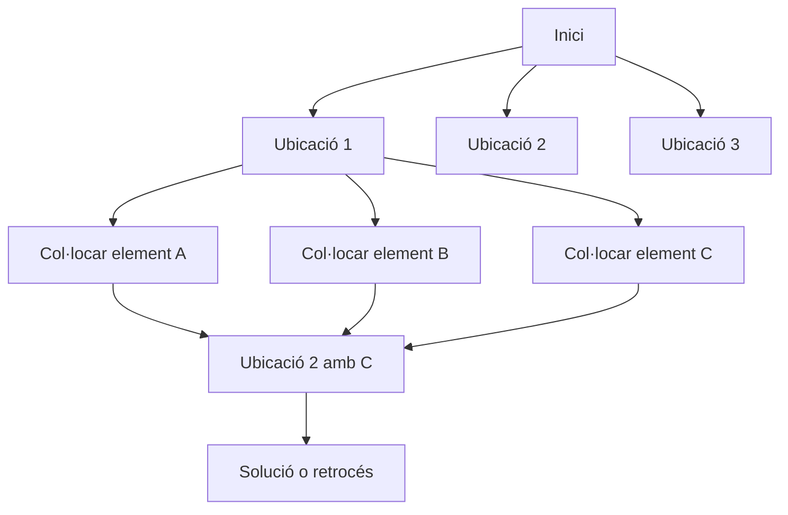

### Respostes al problema

#### 1. Per què l’esquema de *backtracking* és aplicable per a resoldre aquest enunciat?

L’esquema de *backtracking* és aplicable perquè estem buscant una solució entre diverses possibles combinacions
d'ubicacions i elements que compleixen unes restriccions. El problema requereix provar diferents configuracions (
ubicació dels elements a la reixa), descartar aquelles que no compleixin les condicions i retrocedir per provar
alternatives fins a trobar la solució òptima.

#### 2. Pregunta per a cada nivell de l'arbre. Domini de possibles respostes:

A cada nivell de l'arbre ens preguntem:
**Quin element col·loquem a la ubicació actual?**
El domini de possibles respostes són tots els elements que:

- Tenen una longitud igual o inferior a la longitud de l'ubicació disponible.
- Es poden col·locar sense conflictes amb altres elements ja col·locats.

#### 3. Criteri per determinar si una decisió és acceptable (*mètode acceptable*):

Una decisió és acceptable si l’element:

- Té una longitud que coincideix amb la longitud de l’espai disponible.
- No provoca conflictes amb elements ja col·locats a la mateixa fila o columna.
- Respecta la direcció (horitzontal o vertical) de l'ubicació.

#### 4. Criteri per determinar si un conjunt de decisions és completable:

Un conjunt de decisions és completable si:

- Encara queden espais disponibles a la reixa on es poden col·locar els elements restants.
- No s'han generat conflictes que impossibilitin la col·locació d'altres elements en espais restants.

#### 5. Criteri per determinar si un conjunt de decisions és una solució (*mètode esSolució*):

Un conjunt de decisions és una solució si:

- Tots els espais disponibles a la reixa estan completament omplerts.
- Tots els elements seleccionats han estat col·locats sense conflictes.

#### 6. Espai de cerca del problema en *Mermaid*:

- **Alçada de l'arbre:** És igual al nombre màxim d'ubicacions disponibles. És un valor màxim.
- **Amplada de l'arbre:** És igual al nombre màxim d'elements que es poden col·locar a una ubicació en concret. És un
  valor màxim.
- Es pot utilitzar marcatge per evitar recomputacions de subproblemes ja explorats.

#### 7. Criteri per determinar si una solució és millor que una altra:

La millor solució és aquella que té:

- El valor màxim de la suma dels valors ASCII dels caràcters dels elements col·locats a la reixa. Això es calcula sumant
  el valor ASCII de cadascun dels caràcters dels elements col·locats.